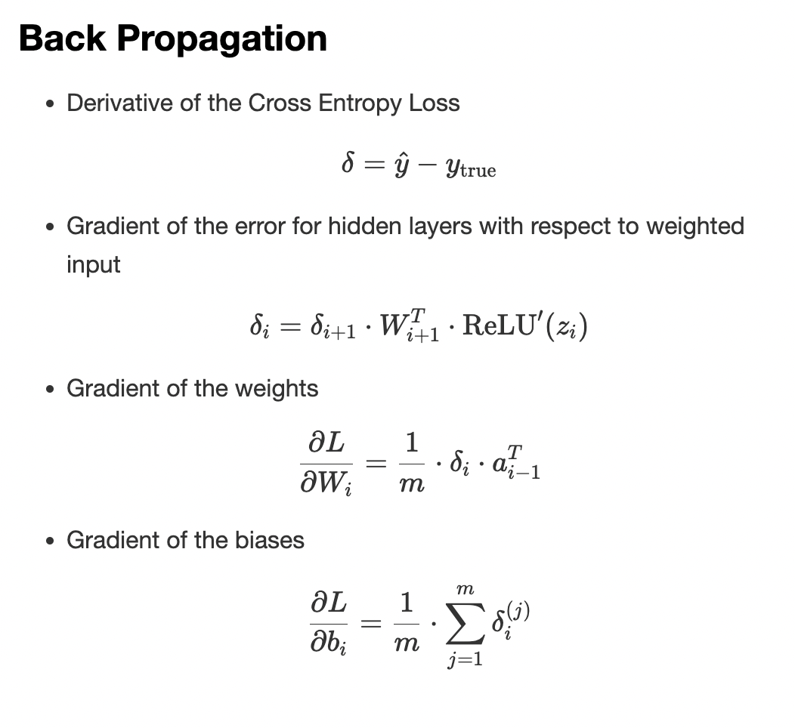

# Building-a-Neural-Network-from-Scratch 🧠
Semester 05-Deep Neural Networks module assigment 01

## Objectives 🎯

- Construct that neural network according to the given problem. (CS3630 Assignment 1.pdf) 
- Implement the back-propagation algorithm, and use gradient descent to train the network. 
- Use cross-entropy cost function on a Softmax function for training. 
- All but the last fully connected layers have ReLU as the activation function.
- For given weight&bias sets, Calculate the gradients using the back propagation implementaton.
- Study the effect of learning rate.




<!-- ## Creating a Virtual Environment
### On macOS

```
cd /path/to/your/project
python3 -m venv env
source env/bin/activate
```

### On Windows
```
cd \path\to\your\project
python -m venv env
env\Scripts\activate
```

## Dpendencies

pip install pandas
pip install numpy -->